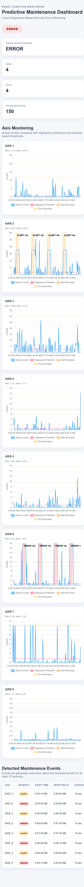
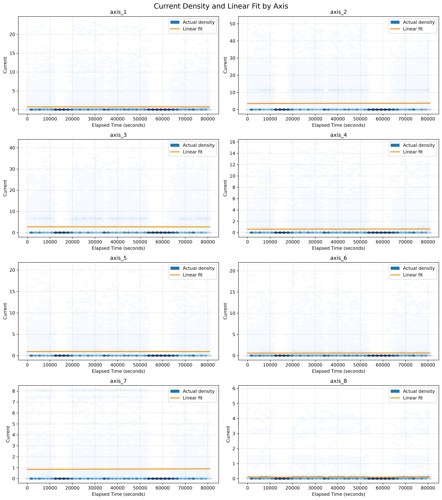
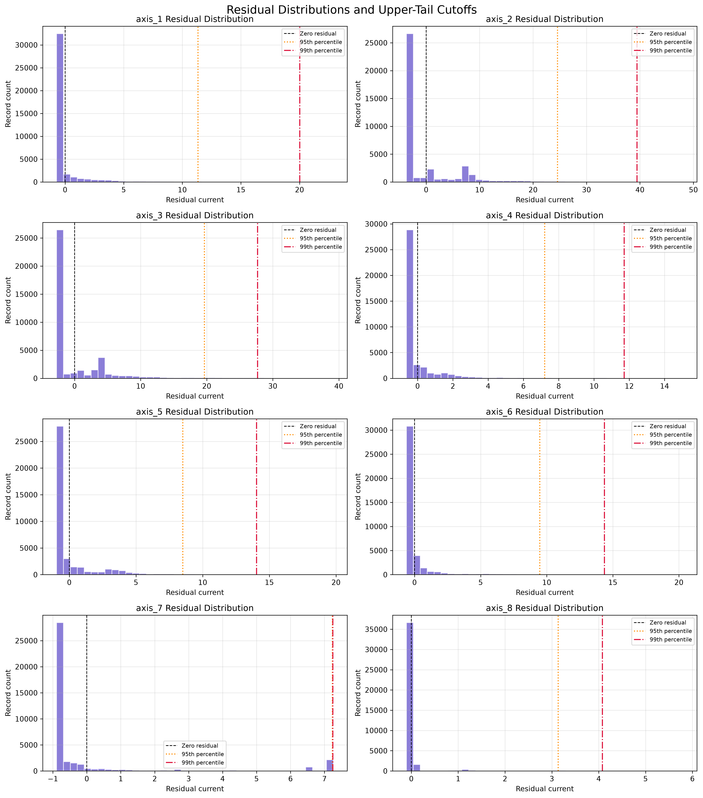
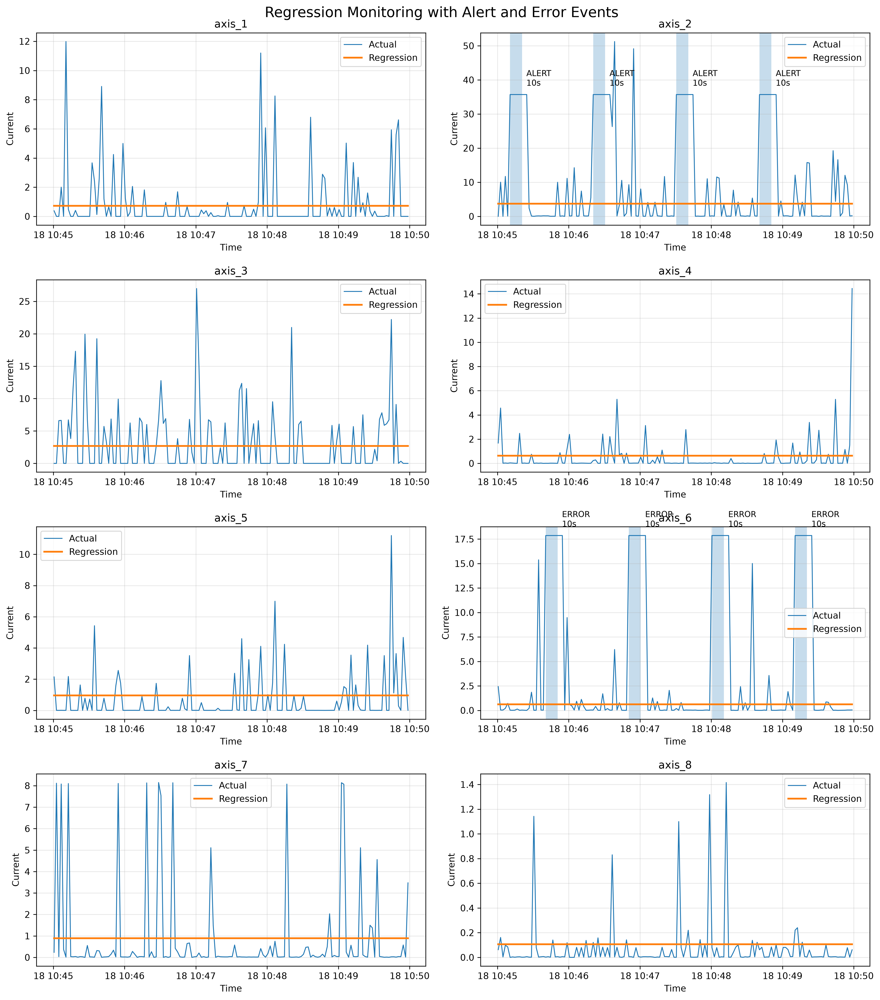

# Predictive Maintenance with Linear Regression-Based Alerts

This project implements a predictive maintenance system for monitoring robot current measurements using Python, Linear Regression, Neon PostgreSQL, synthetic streaming data, residual-based Alert/Error detection, and an interactive Flask web dashboard.

Historical robot data is stored in a Neon PostgreSQL database and used to train separate Linear Regression models for eight robot axes.

The system then simulates new robot measurements, compares the actual current with the regression prediction, calculates residuals, and generates Alert or Error events when abnormal deviations continue for at least 10 seconds.

---

## Project Objectives

The project was created to:

- Store and retrieve robot data using Neon PostgreSQL.
- Train Linear Regression models for Axis 1 through Axis 8.
- Calculate predicted current and residuals.
- Analyze residuals to discover Alert and Error thresholds.
- Generate synthetic testing data based on historical training behaviour.
- Normalize and standardize testing data using training-data parameters.
- Simulate CSV records arriving as a data stream.
- Insert streamed records into PostgreSQL.
- Detect sustained abnormal current behaviour.
- Log Alert and Error events.
- Display results using plots and an interactive web dashboard.

---

## System Architecture

```text
Historical Robot CSV
        |
        v
Neon PostgreSQL
        |
        v
DatabaseManager
        |
        v
RegressionManager
        |
        v
8 Linear Regression Models
        |
        v
Residual Analysis
        |
        v
MinC / MaxC Threshold Discovery
        |
        v
SyntheticDataGenerator
        |
        v
DataPreprocessor
        |
        v
Synthetic Test CSV
        |
        v
StreamSimulator
        |
        +------> Neon streaming_data table
        |
        v
AlertDetector
        |
        v
EventLogger
        |
        v
Interactive Web Dashboard
```

---

## Dataset

The historical robot dataset contains approximately **39,672 records**.

The dataset contains:

- Timestamp information
- Robot current measurements
- Axis #1 through Axis #8 used for modelling

Axis #9 through Axis #14 contained no usable measurements, so they were not included in the predictive maintenance models.

The historical dataset is uploaded to the Neon PostgreSQL `training_data` table and then retrieved from the database before model training.

---

## Database Integration

The project uses a remote **Neon PostgreSQL** database.

Two main database tables are used:

### `training_data`

Stores historical robot measurements used to train the Linear Regression models.

### `streaming_data`

Stores synthetic testing measurements as they are processed by the streaming simulation.

Database credentials are stored locally in a `.env` file and are not committed to GitHub.

---

## Linear Regression

A separate Linear Regression model is trained for every robot axis.

The input variable is:

```text
Elapsed Time
```

The target variable is the current measurement for the corresponding robot axis.

For example:

```text
Elapsed Time -> Axis 1 Current
Elapsed Time -> Axis 2 Current
Elapsed Time -> Axis 3 Current
...
Elapsed Time -> Axis 8 Current
```

The regression equation is:

```text
y = mx + b
```

where:

- `y` = predicted current
- `m` = slope
- `x` = elapsed time
- `b` = intercept

---

## Residual Analysis

After making predictions, residuals are calculated using:

```text
Residual = Actual Current - Predicted Current
```

A positive residual means the actual current is higher than the current predicted by the regression model.

Large positive residuals are important because they may represent abnormal robot behaviour.

Residual statistics were calculated for all eight axes.

---

## Threshold Discovery

Alert and Error thresholds were discovered from the historical residual distributions instead of being selected randomly.

The following approach was used:

```text
MinC = 95th percentile of positive residuals
MaxC = 99th percentile of positive residuals
```

Because each robot axis operates at a different current scale, separate MinC and MaxC thresholds are used for each axis.

| Axis | MinC | MaxC |
|---|---:|---:|
| Axis 1 | 11.34 | 20.03 |
| Axis 2 | 24.57 | 39.45 |
| Axis 3 | 19.66 | 27.70 |
| Axis 4 | 7.21 | 11.71 |
| Axis 5 | 8.52 | 14.04 |
| Axis 6 | 9.47 | 14.37 |
| Axis 7 | 7.23 | 7.25 |
| Axis 8 | 3.14 | 4.08 |

A persistence duration of:

```text
T = 10 seconds
```

is used so that a single temporary spike does not immediately create a maintenance event.

---

## Alert and Error Rules

### Alert

An Alert is generated when:

```text
MinC <= Residual < MaxC
```

continuously for at least:

```text
10 seconds
```

### Error

An Error is generated when:

```text
Residual >= MaxC
```

continuously for at least:

```text
10 seconds
```

An Error represents a more severe condition than an Alert.

---

## Synthetic Testing Data

Synthetic testing data is generated using information learned from the historical training data.

For each axis:

1. The regression model calculates the expected current.
2. Historical residual behaviour is sampled.
3. The sampled residual is added to the regression prediction.
4. Negative current values are prevented.
5. Controlled abnormalities are inserted to test the Alert/Error system.

The reproducible validation scenario contains:

```text
150 records
```

with measurements approximately:

```text
2 seconds apart
```

This represents approximately five minutes of simulated robot operation. The CSV is labeled `SYNTHETIC_TEST`; it is derived from historical residuals and is not a set of genuine machine readings.

To validate sustained event detection more than once, four separated Alert periods are injected on Axis 2 and four separated Error periods on Axis 6. The original historical measurement CSV is not modified. Dashboard counts are computed by running the detector over the synthetic records.

---

## Normalization and Standardization

The preprocessing rules are learned only from historical training data.

### Min-Max Normalization

The training minimum and maximum values are used to normalize the synthetic testing data.

### Z-Score Standardization

The training mean and standard deviation are used to standardize the synthetic testing data.

The scalers are fitted on the training data and then applied to the testing data.

This prevents data leakage.

The original current values are also preserved for regression residual and Alert/Error calculations.

---

## Streaming Simulation

The `StreamSimulator` reads the synthetic CSV file one row at a time.

The normal streaming interval is approximately:

```text
2 seconds
```

Each record is:

```text
Read from CSV
      |
      v
Inserted into Neon PostgreSQL
      |
      v
Sent to AlertDetector
      |
      v
Regression Prediction
      |
      v
Residual Calculation
      |
      v
MinC / MaxC / T Check
```

The regenerated validation outputs process:

```text
150 synthetic records
```

---

## Detection Results

The saved synthetic CSV was evaluated row by row with the `AlertDetector`; controlled abnormalities are test cases, not additional historical observations.

The final validation run detected:

| Axis | Event | Count | Persistence |
|---|---|---:|---:|
| Axis 2 | ALERT | 4 | 10 seconds |
| Axis 6 | ERROR | 4 | 10 seconds |

For Axis 2, the residual remained above MinC but below MaxC for the required time.

For Axis 6, the residual remained above MaxC for the required time.

Detected events are stored in:

```text
data/events_log.csv
```

The log contains information such as:

- Axis
- Event type
- Event start time
- Detection time
- Duration
- Predicted current
- Actual current
- Residual
- Threshold

---

## Interactive Web Dashboard

The project includes an interactive predictive maintenance dashboard created using:

- Flask
- HTML
- CSS
- JavaScript
- Chart.js

The dashboard displays:

- Highest severity detected
- Number of Alerts
- Number of Errors
- Number of processed records
- Actual current
- Regression prediction
- Alert boundary
- Error boundary
- Alert/Error event regions
- Interactive chart values
- Maintenance event table

### Dashboard Preview



To start the dashboard:

```bash
python web_dashboard/app.py
```

Then open:

```text
http://127.0.0.1:5000
```

in a web browser.

---

## Regression Visualization

The following visualization shows the Linear Regression models for Axis 1 through Axis 8.



---

## Residual Visualization

The following visualization shows residual behaviour for all eight robot axes.



---

## Alert and Error Visualization

The Alert and Error periods are displayed on the regression monitoring graphs.



---

## Project Structure

```text
PredictiveMaintenance/
│
├── data/
│   ├── RMBR4-2_export_test.csv
│   ├── synthetic_test_data.csv
│   ├── dashboard_data.csv
│   ├── thresholds.json
│   └── events_log.csv
│
├── images/
│   ├── regression_models.png
│   ├── residual_analysis.png
│   ├── alert_error_regression.png
│   ├── predictive_maintenance_dashboard.png
│   └── web_dashboard.png
│
├── notebooks/
│   └── predictive_maintenance.ipynb
│
├── src/
│   ├── __init__.py
│   ├── database_manager.py
│   ├── regression_manager.py
│   ├── synthetic_data_generator.py
│   ├── data_preprocessor.py
│   ├── stream_simulator.py
│   ├── alert_detector.py
│   ├── event_logger.py
│   ├── visualizer.py
│   └── dashboard.py
│
├── web_dashboard/
│   ├── app.py
│   ├── templates/
│   │   └── dashboard.html
│   └── static/
│       └── style.css
│
├── .env.example
├── .gitignore
├── requirements.txt
└── README.md
```

---

## Object-Oriented Programming

The project uses multiple reusable Python classes.

### DatabaseManager

Responsible for:

- Connecting to Neon PostgreSQL
- Creating database tables
- Uploading training data
- Retrieving training data
- Inserting streaming records

### RegressionManager

Responsible for:

- Training eight Linear Regression models
- Storing slope and intercept values
- Making predictions
- Calculating residuals
- Producing residual statistics

### SyntheticDataGenerator

Responsible for:

- Generating synthetic testing data
- Sampling historical residual behaviour
- Injecting Alert-level abnormalities
- Injecting Error-level abnormalities

### DataPreprocessor

Responsible for:

- Min-Max normalization
- Z-score standardization
- Applying training-data preprocessing rules to testing data

### StreamSimulator

Responsible for:

- Reading CSV records one row at a time
- Simulating time-based streaming

### AlertDetector

Responsible for:

- Calculating incoming regression predictions
- Calculating residuals
- Comparing residuals with MinC and MaxC
- Monitoring continuous abnormal duration
- Generating Alert and Error events

### EventLogger

Responsible for saving detected events to a structured CSV file.

### AnalysisVisualizer

Responsible for regression, residual, and event-overlay plots.

### MaintenanceDashboard

Responsible for the combined static dashboard visualization.

### WebDashboard

Responsible for the Flask application and interactive browser dashboard.

---

## Technologies Used

- Python
- Pandas
- NumPy
- scikit-learn
- Matplotlib
- SQLAlchemy
- psycopg
- Neon PostgreSQL
- python-dotenv
- Flask
- Chart.js
- Jupyter Notebook
- HTML
- CSS
- JavaScript

---

## Installation

Create a Python virtual environment:

```bash
python -m venv .venv
```

Activate it on Windows:

```bash
.venv\Scripts\activate
```

Install the required packages:

```bash
pip install -r requirements.txt
```

---

## Database Configuration

Create a file called:

```text
.env
```

inside the main project folder.

Add the Neon PostgreSQL connection string:

```text
DATABASE_URL=your_actual_neon_connection_string
```

A safe example is included in:

```text
.env.example
```

The real `.env` file is ignored by Git and must not be uploaded to GitHub.

---

## Running the Notebook

Start Jupyter Notebook:

```bash
jupyter notebook
```

Open:

```text
notebooks/predictive_maintenance.ipynb
```

Run the notebook cells in order.

The notebook demonstrates:

- Dataset exploration
- Neon PostgreSQL connection
- Training data retrieval
- Linear Regression
- Residual analysis
- Threshold discovery
- Synthetic data generation
- Normalization
- Standardization
- Streaming simulation
- Alert/Error detection
- Event logging
- Visualizations

---

## Running the Web Dashboard

From the main project folder run:

```bash
python web_dashboard/app.py
```

Then open:

```text
http://127.0.0.1:5000
```

in a web browser.

---

## Security

Sensitive database information is stored in environment variables.

The following are excluded from GitHub:

```text
.env
.venv/
venv/
__pycache__/
*.pyc
.ipynb_checkpoints/
```

Only the safe `.env.example` file should be committed.

---

## Final Outcome

The final predictive maintenance pipeline is:

```text
Historical Robot Data
        |
        v
Neon PostgreSQL
        |
        v
8 Linear Regression Models
        |
        v
Residual Analysis
        |
        v
Data-Driven MinC / MaxC
        |
        v
Synthetic Test Data
        |
        v
Normalization and Standardization
        |
        v
CSV Streaming
        |
        v
Neon PostgreSQL
        |
        v
Alert / Error Detection
        |
        v
Structured Event Log
        |
        v
Interactive Web Dashboard
```

The final validation scenario processed 150 clearly labeled synthetic robot measurements and detected four sustained **Axis 2 Alert** periods and four **Axis 6 Error** periods. These are simulation results, not additional events observed in the original historical dataset.